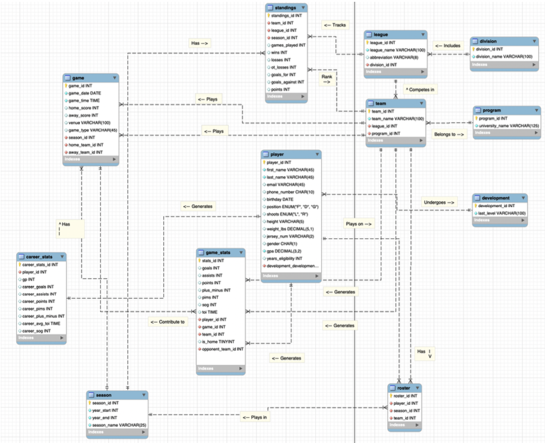

# ACHA(American Collegiate Hockey Association) Database

## Project Overview
This project implements a normalized relational database for the American Collegiate Hockey Association(ACHA), a collegiate club hockey league, to centralize information that is often fragmented across teams and leagues. The database supports league operations and analytics by storing divisions, leagues, programs, teams, seasons, games, rosters, and player statistics in a queryable MySQL schema. In addition to standard relational design, the project includes stored procedures and triggers to automate common administrative workflows and enforce data integrity.

This database could be used primarily by 4 types of users:
- League admins
- Teams/coaches
- Current and prospective players
- Family/friends/fans
--- 

## Motivation
The NCAA governs varsity college athletics, and among its sports is ice hockey. Across Men's
and Women's programs, the NCAA oversees ~200 teams. Meanwhile, the American Collegiate
Hockey Association (ACHA) governs club hockey and oversees ~530 teams across 3 Men's and
2 Women's divisions. Given the nature of club hockey, there is limited coverage and funding
available despite the vast number of teams and participants. Often this leads to confusion about
players, teams, schedules, and even results, across such a vast and complex web of games.
Creating a centralized and queryable database that is open to all would allow teams, coaches,
family members, and even fans (of which there are few) to better understand the landscape of
club hockey and where they stand at a given point. This database could track players, teams,
leagues, divisions, statistics, and results all in one place, allowing users to quickly determine
important information, rather than having to ask around or wait for data that may be out of date
to be released.

## Goal
The goal of this project is to create a queryable database that allows users to upload and access real-time data about game results and player information in the ACHA. By democratizing access to
this information, the hope is that collegiate club hockey can gain transparency and a higher
degree of professionalism. In doing so, the experience for players, coaches, and families can be
improved.

This app is intended to provide the ACHA with a similar level of data accessibility
compared to NCAA and professional hockey, despite the organization's unique challenges (more
players, less funding, more schools, etc.). By creating a queryable database and augmenting it with stored procedures and triggers, non-administrators can find information that is pertinent to
them.

## Stakeholders & Example Use Cases
More complex queries that demonstrate the depth and richness of the information that can be extracted are included in `ACHA_db_queries.sql`. The outputs for each query are provided at the end of the README to demonstrate and verify correct functionality.

**League Administrators**
- Identify players approaching eligibility limits and validate eligibility constraints.
- Track standings and determine league leaders by season.

**Teams & Coaches**
- Analyze player performance and efficiency (e.g., points-per-game with meaningful game thresholds).
- Evaluate how development background relates to scoring efficiency and impact.
- Identify high-impact programs producing top performers.

**Current & Prospective Players**
- View season-by-season performance trends and usage (e.g., TOI-based opportunity).
- Compare rookie contributions and opportunities across teams.

**Fans & Families**
- Pull a player’s career overview and context (program/league/division) with key stats.
- Explore rivalry-style matchups using repeated close score margins.

## Repository Contents
- `ACHA_db_SETUP.sql` — Schema creation (tables, keys, core constraints).
- `ACHA_db_procedures.sql` — Stored procedures used for season/game workflows.
- `ACHA_db_procedure_tests.sql` — Procedure test calls / validation scripts.
- `ACHA_db_queries.sql` — Example queries covering stakeholder use cases.
- `Dump_ACHA_db.sql` — Full database dump (schema + data) for one-command restore.
- `ACHAdb_diagram_FINAL.mwb` — MySQL Workbench ER diagram/model.
- `hockey_data/` — CSV exports used to populate tables (alternative to dump restore).

## Setup & Usage

### Option A: Restore From SQL Dump (Recommended)
This recreates the database exactly as used for the project (tables + data).
1. Open MySQL Workbench and connect to your MySQL instance.
2. Use **Server → Data Import** and select `Dump_ACHA_db.sql` to restore.
3. After import, open and run:
   - `ACHA_db_queries.sql` for example analyses
   - `ACHA_db_procedure_tests.sql` to validate procedures

### Option B: Build From Schema + CSVs
Use this option if you prefer importing table data from CSV exports.
1. Run `ACHA_db_SETUP.sql` to create the schema.
2. Import CSVs from `hockey_data/` into their matching tables (Workbench Table Data Import Wizard).
3. Run `ACHA_db_procedures.sql` to create procedures and triggers.
4. Run `ACHA_db_procedure_tests.sql` to validate procedure behavior.
5. Run `ACHA_db_queries.sql` to execute the demonstrated query suite.

## Database Design
The database structure was created in MySQL Workbench, with a focus on:
1. Designing normalized tables with appropriate relationships
2. Establishing entity-relationship models
3. Creating stored procedures and triggers to automate and simplify common application operations such as eligibility notifications and season/game rollover
4. Developing a data model that allows for future scaling and feature expansion

Below is the ER diagram, which can be found in `ACHAdb_diagram_FINAL.mwb`, that shows the entire database design:

  

  ER Diagram

## Data Sources and Methods

When creating the app, there were a few intentional design choices made to keep a reasonably sized data set while still ensuring realistic data. Two real ACHA leagues were modeled in each Men’s division (I, II, and III), resulting in a total population of 53 teams. For simplicity, each team was mapped to its own program (in practice, a program could have multiple teams, each in a different division). Furthermore, each roster was capped at 20 players (12 forwards, 6 defense, and 2 goalies), which allowed avoidance of cases where only certain players participate in certain games. Player attributes replicated plausible ranges seen throughout the ACHA, including height, weight, birth years, GPA, and related characteristics. Due to the nature of some players’ careers, a column was added to track years of eligibility remaining (between 1 and 5 years), with higher weights assigned to greater eligibility durations, as players are more likely to quit or retire later in their careers. These unique paths were captured by randomly selecting from different developmental backgrounds, such as high school, prep, and junior levels. In terms of season structure, three distinct seasons were defined, each with 6 games per team (3 home and 3 away). This resulted in fewer than 500 games while still producing sufficient variety to showcase realistic queries and applications of the database.

To actively generate the mock data, a Python script was developed that adhered to the previously defined assumptions. Dictionaries were established for each team, and venues and mascots were mapped to each team accordingly. The Faker library was used to create synthetic player information, such as names and contact details, to populate each team. For each game, the script randomly simulates game outcomes and then populates statistics for each player on the roster. This process was performed realistically, with forwards having a higher probability of scoring, each goal having 0–2 assists with weighted probabilities, only skaters accumulating shots on goal, and penalty minutes being derived from realistic distributions of possible offenses. The per-game statistics were then aggregated into season and career totals across multiple seasons. The results of the generation process were exported into a set of CSV files that could be imported into SQL Workbench in the order specified by the SETUP file.

## Procedures and Triggers

The database includes several key procedures and triggers that help manage seasons, games,
player eligibility, and more. The first key procedure was titled finish_season, which can be called
at the end of a given season. This reduces players' eligibility by a year and also initializes the
upcoming season by calling the start_season. 

Start_season takes a year to be the start year of the new season. The procedure then adds a new entry to the season table, initializes new rosters for the upcoming season, and establishes a new season of standings in the respective table with statistics reset to zero. When creating the new rosters, information is pulled from the teams of the previous season if available, excluding any player whose years of eligibility are zero. If no data is available, this step is skipped, and it is expected that the rosters will be populated at a later date.

Schedule_game takes in season_id, date, time, home_team_id, away_team_id, venue, and
game_type. It generates errors if the home and away teams are the same or if one does not exist
in the team table; otherwise, it initializes the game in the game table with null scores. For clarity,
errors in this and other procedures would be handled by the GUI, but since the project is limited to the database level, they are handled via a SIGNAL SQLSTATE and an error message. 

The finalize_game procedure takes in a game_id, home score, and away score and finalizes the
results of a game. Errors occur if either score is negative or if the game_id does not exist in the
game table. If this check passes, then the scores are updated into the given game, and the
standings are modified with the relevant information (e.g. wins, losses, goals for, etc.). Finally,
record_game_stats updates a player's stats for a given game by taking in a player_id, game_id,
and relevant stats. It errors if any inputted stats are invalid or if the player or game does not exist.
After validation, the information is inserted into the game_stats table.

Two important triggers were also implemented to maintain the integrity of the system and automate
some statistical calculations. The stats_aggregation trigger operates after an insertion into the
game_stats table for a given player, automatically modifying that individual's career totals in the
career_stats table. The eligibility_check trigger ensures eligibility for a player before an insertion
into the game_stats table. It verifies that a player meets the minimum GPA threshold and still
holds years of eligibility. If any of these checks fail, an error is generated, and the insertion into
game_stats is stopped.

## Query Outputs
